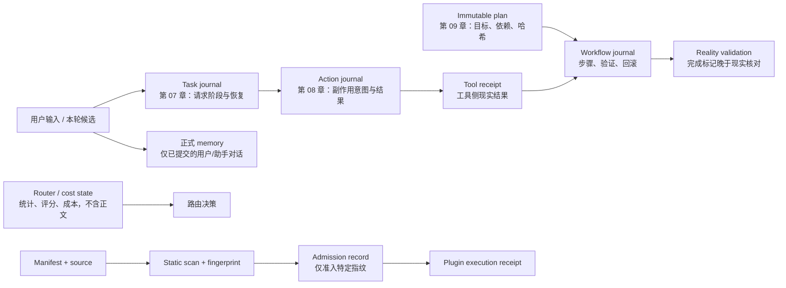

# 第一季（第 01—10 章）完整审计报告

审计日期：2026-07-23

基线分支：`origin/main`

基线提交：`6a48da8067f678913b8893a3121c9d7bd5d46be9`（审计开始时与预期一致，远端没有新增提交）

审计分支：`codex/season-1-full-audit`

## 1. 执行摘要

本次审计把第一季视为十个必须各自可运行、同时按认知顺序演进的研究日记，而不是一个等待合并重构的应用。只读基线阶段从 `git archive HEAD chapters` 得到仅含已跟踪文件的隔离副本，在 Python 3.12 虚拟环境中安装锁定的章节依赖，并在 macOS `sandbox-exec` 的拒绝网络策略下运行所有测试、自检、检查命令和离线演示。没有创建或读取真实 `.env`，没有使用真实 API Key，没有调用模型、外部工具或付费服务，也没有把仓库中的 `data/` 或用户状态复制到审计目录。

基线的 333 项既有单元测试全部通过，02—10 章的 `--self-test`、所有声明的离线检查命令，以及 07—10 章共 13 个离线 demo 全部通过。102 个 Python 文件通过 Python 3.10 语法树解析和 Python 3.12 `py_compile`。这证明正常路径整体可运行，但不能证明声明的安全边界成立；故障注入随后复现了多项测试未覆盖的确定问题。

最重要的基线发现是：

- 第 06、07 章仍可能在远端结果未知时由自动 fallback 或 SDK 内部重试产生第二次付费请求；
- 第 08 章会把同一幂等键下的不同请求错误复用为原效果，且受篡改的本地回执可令补偿删除工具根目录外的文件；
- 第 09 章的 `workflow_id` 可路径穿越，计划文件篡改未与流水账哈希核对，工具完成后 Runtime 崩溃时回滚会漏掉真实副作用却标记工作流已回滚；
- 第 10 章可使用旧 `ScanReport` 绕过源码变更后的准入失效，bundled `local_note` 插件可写出 workspace；probe / preview 的独立进程和临时目录也不是不可信代码沙箱；
- 第 05 章主分支最近一次 CI 在两个 Windows 组合中均因中文输出编码失败，因而文档中的跨平台验证声明在基线上不成立。

基线结论是 **FAIL**：测试全绿不足以抵消上述 P1 安全问题。本审计分支完成最小修复后，104 个 Python 文件通过 Python 3.10 语法检查，377 项单元测试、9 个 `--self-test`、全部检查命令和 13 个离线 demo 在拒绝网络的沙箱中通过，候选树没有 `.env`、`data/`、字节码或缓存。最终结论提升为 **PASS_WITH_FIXES**。第 10 章仍只能作为“已人工审查的本地插件”教材，不能宣传为可运行任意不可信插件的安全环境。

## 2. 审计方法与实际命令

### 2.1 基线和隔离

实际执行：

```text
git fetch origin
git pull --ff-only origin main
git rev-parse HEAD
git switch -c codex/season-1-full-audit --track origin/main
git archive HEAD chapters
python3.12 -m venv /tmp/re-llm-diary-audit.<random>/venv
python -m pip install openai==2.45.0 python-dotenv==1.2.1
```

运行章节代码时显式移除 `OPENAI_API_KEY`、`DEEPSEEK_API_KEY`、`ZHIPU_API_KEY`、`GLM_API_KEY` 等变量；需要通过 `--check-config` 的章节只注入 `audit-placeholder-not-a-key`，不写 `.env`。所有 Python 运行命令都由以下本机沙箱策略包裹：

```text
/usr/bin/sandbox-exec -p '(version 1) (allow default) (deny network*)' ...
```

因此本次结果只覆盖离线行为。真实账户权限、余额、服务端返回、地区网络和收费行为均为 **NOT_RUN（按审计约束禁止）**。

### 2.2 通用验证

实际执行：

```text
python -c 'ast.parse(..., feature_version=(3, 10))'   # 102 个 Python 文件
python -m py_compile ...                              # 102 个 Python 文件
python -m unittest discover -s tests -v              # 每个存在 tests/ 的章节
git diff --check
git ls-files
git status --ignored --short
```

macOS / Linux 文档命令经过 shell 语义核对并在 macOS 实际运行。当前审计机没有 PowerShell，故 01—04 章的 PowerShell 命令为 **NOT_RUN（本机缺少 `pwsh`）**；05—10 章另以 GitHub Actions 的 Windows runner 结果作为证据，不能用文本检查代替实际执行。

### 2.3 章节命令

除单元测试外，实际执行了：

```text
# 01
python main.py                                  # 无 Key，验证最短失败路径

# 02
python main.py --self-test
python main.py --check-config

# 03—04
python main.py --self-test
python main.py --check-config
python main.py --check-memory

# 05
python main.py --self-test
python main.py --check-config
python main.py --check-router

# 06
python main.py --self-test
python main.py --check-config
python main.py --check-memory
python main.py --check-router

# 07
python main.py --self-test
python main.py --check-config
python main.py --check-memory
python main.py --check-router
python main.py --check-journal
python main.py --demo-recovery

# 08
python main.py --self-test
python main.py --check-actions
python main.py --check-receipts
python main.py --demo-idempotency
python main.py --demo-receipt-recovery
python main.py --demo-unknown
python main.py --demo-compensation

# 09
python main.py --self-test
python main.py --check-journal
python main.py --demo-success
python main.py --demo-validation-failure
python main.py --demo-resume
python main.py --demo-rollback

# 10
python main.py --self-test
python main.py --demo-discovery
python main.py --demo-admission
python main.py --demo-clarification
python main.py --demo-stale
```

## 3. 每章实际运行结果

| 章 | Python 3.10 语法 | 基线单测 | 自检 / 检查 / demo | 最短成功或安全失败路径 | 平台证据 |
|---|---:|---:|---|---|---|
| 01 | PASS | 0 → 0（无 tests） | 无自检 | PASS：无 Key 时在联网前退出 1，错误信息正确 | macOS 实跑；Linux/Windows NOT_RUN |
| 02 | PASS | 0 → 6 / 6 | PASS：self-test、check-config | PASS（离线配置路径） | macOS 实跑；Linux/Windows NOT_RUN |
| 03 | PASS | 6 → 7 / 7 | PASS：self-test、config、memory | PASS | macOS 实跑；Linux/Windows NOT_RUN |
| 04 | PASS | 13 → 14 / 14 | PASS：self-test、config、memory | PASS | macOS 实跑；Linux/Windows NOT_RUN |
| 05 | PASS | 16 → 19 / 19 | PASS：self-test、config、router | PASS（本机）；基线 Windows CI FAIL | 基线 Ubuntu/macOS PASS；修复分支 CI 见 PR |
| 06 | PASS | 37 → 39 / 39 | PASS：self-test、config、memory、router | PASS | 基线六个 CI 组合 PASS |
| 07 | PASS | 50 → 51 / 51 | PASS：全部检查和 recovery demo | PASS | 基线六个 CI 组合 PASS |
| 08 | PASS | 88 → 98 / 98 | PASS：全部检查和 4 个 demo | PASS | 基线六个 CI 组合 PASS |
| 09 | PASS | 58 → 67 / 67 | PASS：journal 和 4 个 demo | PASS | 基线六个 CI 组合 PASS |
| 10 | PASS | 65 → 76 / 76 | PASS：self-test 和 4 个 demo | PASS | 基线六个 CI 组合 PASS |
| **合计** | **104 文件 PASS** | **333 → 377 / 377** | **全部声明的离线命令 PASS** | **真实 API NOT_RUN** | **修复分支 CI 见 PR** |

README / VERIFICATION 明示的基线测试数量与当时实际值一致：04 为 13、06 为 37、07 为 50、08 为 88、09 为 58、10 为 65。修复后文档已同步为 02:6、03:7、04:14、05:19、06:39、07:51、08:98、09:67、10:76。

## 4. 问题清单

严重度含义：

- **P0**：会造成广泛、不可逆或立即泄密的阻断问题；
- **P1**：可导致重复付费、越界副作用、错误完成/回滚或明确安全边界失效；
- **P2**：可靠性、跨平台、输入完整性或教材声明存在重要缺口；
- **P3**：低风险文档、验证可追溯性或工程卫生问题。

### 4.1 P0

未发现 P0。没有发现已跟踪的真实 `.env`、API Key、`data/`、用户对话或运行回执。

### 4.2 P1

#### P1-01　第 06 章会在远端结果未知时自动 fallback，SDK 还会内部重试

- 基线位置：`chapters/06-cost-verification/main.py:145,513-533`；`providers.py` 的客户端构造。
- 复现：读取默认设置可见 `AUTO_FALLBACK` 默认为 true；客户端 `max_retries=2`。令请求在发送后丢失响应，异常会进入下一个候选，SDK 也可能先重发。
- 影响：同一用户意图可能产生多笔费用；本地“失败”不能证明远端未完成。
- 处置：**已修复**。SDK 重试关闭，`AUTO_FALLBACK` 默认改为 false；显式启用时文档继续警告第 06 章尚无持久 `remote_unknown`。

#### P1-02　第 07 章的 SDK 重试与“远端未知时禁止自动重试”矛盾

- 基线位置：`chapters/07-interrupt-recovery-replay/providers.py:178-192`；声明见 `README.md:100-115`。
- 复现：用假 Key 构造离线客户端，`client.max_retries == 2`。
- 影响：流水账虽然阻止 Runtime fallback，SDK 自己仍可能在一个 attempt 内发送多次请求。
- 处置：**已修复**：`max_retries=0`，并由客户端构造参数回归测试固定。

#### P1-03　第 08 章同一幂等键可绑定不同请求

- 基线位置：`chapters/08-tool-effects-idempotency/actions.py:52-71`；`tools.py:103-106`。
- 复现：先以键 K 创建标题 A/正文 A，再以同一 K 提交标题 B/正文 B；第二次返回 `reused=True` 和 A 的回执，不拒绝冲突。基线 self-test 还把这一行为当作成功。
- 影响：调用方可能把旧效果误认为新请求已执行；幂等键不再能唯一表示业务动作。
- 处置：**已修复**：重放前核对计划中的工具和规范化请求；孤立回执默认拒绝；补偿键也核对原回执。

#### P1-04　第 08 章补偿会信任回执中的任意 `effect_ref`

- 基线位置：`chapters/08-tool-effects-idempotency/tools.py:130-156`。
- 复现：在隔离临时目录中把本地回执的 `effect_ref` 改为工具根目录外的 `valuable.txt`，再调用 `compensate`；该文件被删除。
- 影响：损坏或可写的回执状态可把“删除测试笔记”扩大为任意本机文件删除。
- 处置：**已修复**：按工具根目录、确定性文件名和符号链接解析结果三重校验后才允许补偿。

#### P1-05　第 09 章 `workflow_id` 可穿越计划目录

- 基线位置：`chapters/09-cross-tool-validation-replay/workflow.py:19-35,50-61`。
- 复现：`create_plan(..., workflow_id="../../escaped")` 在 `data_root/plans` 外写入 `escaped.json`。
- 影响：调用者可覆盖工作区内其他 JSON 路径；后续读取同样越界。
- 处置：**已修复**：限制工作流 ID 字符集和长度，解析后再次做根目录包含检查。

#### P1-06　第 09 章计划哈希写入流水账后从未验证

- 基线位置：`chapters/09-cross-tool-validation-replay/workflow.py:57-60,72-74,114-116`；声明见 `README.md:73`、`VERIFICATION.md:10`。
- 复现：创建计划后直接修改计划 JSON 的正文、哈希和 step 期望，再执行；基线 Runtime 接受篡改计划并返回 `complete`。
- 影响：“不可变计划”只在二次 `save()` 时生效，磁盘篡改或损坏会静默改变真实效果。
- 处置：**已修复**：执行和回滚前将加载计划哈希与唯一 `workflow_planned` 事件核对，并核对 ID。

#### P1-07　第 09 章工具完成后崩溃，回滚会漏副作用却标记已回滚

- 基线位置：`chapters/09-cross-tool-validation-replay/workflow.py:76-87,114-133`。
- 复现：以 `crash_after_document_tool=True` 执行；文档和工具侧回执已存在，Runtime 流水账没有 step receipt。直接 `rollback()` 得到空 `compensated_steps`，文件仍存在，但写入 `workflow_rolled_back`。
- 影响：审计记录宣称回滚完成，现实副作用却保留。
- 处置：**已修复**：回滚缺少 Runtime 回执时先按原幂等键查询工具、验证绑定，再记录恢复事件并补偿；现实效果存在但工具回执也缺失时拒绝写入“已回滚”。

#### P1-08　第 09 章工具直接复用同键回执而不核对效果参数

- 基线位置：`chapters/09-cross-tool-validation-replay/tools.py:26-29,43-46,86-89,101-104`；声明见 `TROUBLESHOOTING.md:15-17`。
- 复现：用相同键分别请求不同路径/内容、不同标题/哈希或不同被补偿回执，工具直接返回第一次的回执。
- 影响：同一幂等键可代表不同效果，恢复和回滚证据不可信。
- 处置：**已修复**：四种操作分别验证 operation、tool、effect metadata 与本次请求完全一致。

#### P1-09　第 10 章旧 `ScanReport` 可绕过源码变更后的准入失效

- 基线位置：`chapters/10-plugin-discovery-admission/runtime.py:31-48`；`admission.py:23-49`；声明见 `README.md:95-97`。
- 复现：scan → admit → 修改 `plugin.py` → 把旧 report 交给 `execute()`；基线仍执行修改后的源码。
- 影响：准入绑定的是旧内容，但真正导入执行的是新内容，形成典型检查/使用时差漏洞。
- 处置：**已修复**：每次启动插件子进程前重新计算 manifest/entrypoint 指纹并与 report 比较。

#### P1-10　第 10 章 bundled `local_note` 可越过 workspace

- 基线位置：`chapters/10-plugin-discovery-admission/plugins/local_note/plugin.py:8-20`。
- 复现：执行输入 `directory="../outside"`；文件写入 workspace 的兄弟目录。`query` 和 `compensate` 同样接受任意相对/绝对路径。
- 影响：教材自带的副作用插件可修改或删除工作区外文件。
- 处置：**已修复**：所有目标先 `resolve()`，要求严格位于 workspace 内，并拒绝借助符号链接越界。

### 4.3 P2

#### P2-01　第 02 章接受非有限价格和负 Token

- 基线位置：`chapters/02-token-cost/main.py:95-103,207-238`。
- 复现：价格为 `Infinity` 会通过；`NaN` 在比较时抛出未规范化异常；usage 的负数字段会进入统计和成本。
- 影响：成本可成为非有限值或负数，统计失真，JSON/输出不可移植。
- 处置：**已修复**：要求 Decimal 有限；usage 字段严格解析为非负整数并校正不足的总数。

#### P2-02　第 03—05 章付费成功但记忆保存失败时不显示回答

- 基线位置：`chapters/03-persistent-memory/main.py:176-184`、`04-second-model/main.py:353-361`、`05-adaptive-router/main.py:527-544`。
- 复现：让 `store.save(candidate)` 抛 `OSError`；回答已从模型返回，但只打印保存错误，回答位于 `continue` 之后而不可见。
- 影响：用户可能再次发起同一付费请求；第 06 章已经用“助手（未保存）”修正此边界。
- 处置：**已修复**：保存失败时仍明确显示未保存回答，不把它加入当前正式记忆。

#### P2-03　第 05 章路由状态接受 `nan` / `inf`

- 基线位置：`chapters/05-adaptive-router/router.py:60-66,105-127`。
- 复现：`record_result(True, float("nan"))` 或从 JSON 加载非有限累计延迟；比较不会拦截，Python JSON 还会输出非标准 `NaN`。
- 影响：评分和路由排序可永久污染。
- 处置：**已修复**：使用 `math.isfinite`，并覆盖加载和运行时路径。

#### P2-04　第 05 章主分支 Windows CI 实际失败

- 基线位置：`.github/workflows/verify-chapter-05.yml:16-43`；声明见 `VERIFICATION.md:27`。
- 复现：GitHub Actions run `29487157429`；Windows 3.10 和 3.13 的 Offline self-test 均在打印中文时抛 `UnicodeEncodeError`。Ubuntu/macOS 通过。
- 影响：文档声称的六组合跨平台验证不成立。
- 处置：**代码已修复，CI 待 PR 证明**：与 06—10 章一致设置 `PYTHONUTF8=1`。

#### P2-05　第 08 章尾部修复覆盖写不是原子替换

- 基线位置：`chapters/08-tool-effects-idempotency/journal.py:172-174`。
- 复现：`repair_truncated_tail()` 备份后直接 `write_bytes` 覆盖原文件；在写入中断时可丢失原文件和修复结果。
- 影响：故障恢复路径本身可能制造更严重损坏。
- 处置：**已修复**：临时文件、fsync、`os.replace`；保留现有备份，并测试 replace 失败时原文件不变。

#### P2-06　第 09 章计划、索引和 JSONL durability 低于第 08 章

- 基线位置：`workflow.py:26-35`、`tools.py:82-84`、`journal.py` 的 append。
- 复现：源码检查可见直接 `write_text`；流水账只 flush 不 fsync。故障注入无法可靠区分“已完成但未落盘”。
- 影响：截断写、丢回执和错误恢复概率上升，是跨章节安全边界回退。
- 处置：**已修复本次低风险部分**：计划和索引原子 JSON 保存，JSONL append fsync；跨进程锁留作第二季架构债务。

#### P2-07　第 10 章 manifest 布尔字段宽松转换，且未要求 admission 所需方法

- 基线位置：`chapters/10-plugin-discovery-admission/manifest.py:42-72`。
- 复现：JSON 字符串 `"false"` 经 `bool(...)` 变成 true；缺少 `probe` / `preview` 的 manifest 可通过加载，直到 admission 运行时失败。
- 影响：manifest 含义可漂移，错误在过晚阶段暴露。
- 处置：**已修复**：布尔字段只接受 JSON boolean；所有插件必须声明 probe/preview，副作用插件还必须声明幂等。

#### P2-08　第 10 章不拒绝符号链接插件目录、manifest 或 entrypoint

- 基线位置：`scanner.py:40-53,92-96`。
- 复现：把插件目录或入口文件做成指向插件根外的符号链接，discovery 会读取，后续准入可能执行外部源码。
- 影响：“发现只读插件目录”边界可被工作区链接绕过。
- 处置：**已修复**：发现和扫描阶段显式拒绝三类符号链接及根目录外解析结果。

#### P2-09　第 10 章允许未声明输入，回执保存也可静默覆盖冲突

- 基线位置：`runtime.py:37-48`、`receipts.py:47-48`。
- 复现：传入 `required_inputs` 之外字段会进入 plan key，即便插件完全忽略它；相同 plan key 的不同 `RunReceipt` 可覆盖旧值。
- 影响：业务效果与幂等计划键不再一一对应，损坏/竞态可改写审计证据。
- 处置：**已修复**：拒绝未声明输入；计划键绑定插件指纹；`put` 遇到不同回执时报冲突。

#### P2-10　第 10 章 admission 不是不可信代码隔离，指纹也只覆盖两个文件

- 基线位置：`admission.py:15-75`、`scanner.py:14-21`、`plugin_runner.py:10-18`；文档已在 `README.md:87-89` 和 `VERIFICATION.md:26-28` 限定。
- 复现：受控恶意 probe 写入临时 workspace 的父目录后仍被准入；AST 别名、动态导入、顶层 import-time 代码和 helper 模块不在完整约束/指纹中。快照只比较临时目录内文件名和大小。
- 影响：未知插件可读取或修改真实目录；同大小内容变化或未指纹 helper 变化可能逃过旧准入。
- 处置：**不在第一季实现伪沙箱**。保留明确警告，并在第二季使用 OS sandbox / 容器 / VM、最小挂载、无真实 HOME/密钥、完整包指纹和签名策略。

#### P2-11　第 01—04 章自动化验证缺口

- 基线位置：01、02 没有 tests；`.github/workflows/` 只有 05—10。
- 复现：`unittest discover` 对 01、02 无测试可运行；没有 01—04 workflow。
- 影响：早期章节最易被新手复制，却缺少 Windows、最低 Python 和错误配置回归。
- 处置：第 02 章新增 6 项故障路径测试，第 03、04 章各补 1 项；第 01 章和 01—04 CI 缺口保留为独立维护任务，不合并章节框架。

#### P2-12　`.gitignore` 未覆盖常见测试/覆盖率产物

- 基线位置：根 `.gitignore`。
- 复现：没有 `.pytest_cache/`、`.coverage`、`htmlcov/`、`coverage.xml` 等规则。
- 影响：维护者切换测试工具后可能误提交生成物；当前 unittest 本身未生成这些文件。
- 处置：**已修复**。

### 4.4 P3

#### P3-01　第 04 章 VERIFICATION 引用仓库中不存在的部署脚本

- 基线位置：`chapters/04-second-model/VERIFICATION.md:44-52`。
- 影响：读者无法复现“部署脚本验证”；`v0.0.4` 标签存在不能证明该脚本仍存在。
- 处置：**已修复**：改为历史发布说明，并明确脚本不属于交付内容。

#### P3-02　01—04 的 Windows 命令缺少当前自动化执行证据

- 基线位置：各章 README / TROUBLESHOOTING。
- 影响：命令文本看起来合理，但本次本机没有 PowerShell，不能标记为实际 PASS。
- 处置：保持 **NOT_RUN**，不伪造证据。

#### P3-03　第 06 章 VERIFICATION 是未勾选清单，不是已执行记录

- 基线位置：`chapters/06-cost-verification/VERIFICATION.md:5-17`。
- 影响：与其他章节的 “Verified Offline” 表述方式不一致，容易混淆计划与证据。
- 处置：在本报告记录本次离线结果；真实 API 项继续 NOT_RUN。

#### P3-04　workflow 的 paths filter 不会因根文档矛盾而触发章节 CI

- 基线位置：`.github/workflows/verify-chapter-05.yml` 至 `verify-chapter-10.yml`。
- 影响：只修改根 README、roadmap 或 changelog 时不会重新验证对应章节。
- 处置：报告记录；是否扩大触发范围属于 CI 成本选择，不在本次批量改变。

#### P3-05　跨进程并发、目录 fsync 和文件锁没有统一策略

- 基线位置：03—10 的本地状态存储。
- 影响：单进程演示成立，但多个进程并发写可能丢更新；断电后的目录项持久性未严格保证。
- 处置：第二季架构债务；不向早期章节倒灌统一存储框架。

## 5. 代码、文档和验证不一致

| 声明 | 基线事实 | 结论 |
|---|---|---|
| 07：远端未知时禁止自动重试 | SDK `max_retries=2` | 不一致，P1-02 |
| 08：同一键代表同一业务动作 | 不同 payload 被静默复用 | 不一致，P1-03 |
| 09：不可变计划和哈希 | 执行/回滚不核对流水账 plan hash | 不一致，P1-06 |
| 09：崩溃后查询工具回执再恢复/回滚 | execute 会查询，rollback 不查询 | 部分实现，P1-07 |
| 09：同键不绑定不同效果 | 四种工具操作均无请求绑定核对 | 不一致，P1-08 |
| 10：源码变化后旧准入失效 | 重新 scan 时成立；复用旧 report 时不成立 | 不完整，P1-09 |
| 10：临时目录检测 probe/preview 文件副作用 | 只能看到目录内变化，无法拦截父目录或真实 HOME | 文档已警告非沙箱，但实验描述需按信任边界理解 |
| 05：GitHub Actions 跨平台离线测试 | Windows 两组合失败 | 不一致，P2-04 |
| 04：部署脚本会重新验证并打标签 | 仓库中没有该脚本 | 不可复现，P3-01 |
| 06：VERIFICATION 清单 | 本次离线项已执行，真实 API 项未执行 | 需区分 PASS 与 NOT_RUN |

根 README、`docs/roadmap.md` 和 `docs/changelog.md` 对十章已经发布、主题顺序和测试数量的总体描述准确；但 changelog 中“第 07 章远端未知禁止自动 fallback”“第 10 章源码变化自动 stale”等短句需要以上实现边界才能完全成立。

2026-07-23 重新核对官方资料后，仓库当前默认值仍一致：DeepSeek 官方价格页列出 `deepseek-v4-flash`、`https://api.deepseek.com` 及美元 0.0028 / 0.14 / 0.28 每百万 Token；智谱官方文档仍列出 `glm-5.2` 和 OpenAI 兼容端点 `https://open.bigmodel.cn/api/paas/v4/`。价格与模型均属会变化的外部事实，章节继续要求实际使用前复核。

- DeepSeek：https://api-docs.deepseek.com/quick_start/pricing
- 智谱 GLM-5.2：https://docs.bigmodel.cn/cn/guide/models/text/glm-5.2
- 智谱 HTTP / OpenAI 兼容接口：https://docs.bigmodel.cn/cn/guide/develop/http/introduction

## 6. 缺失或不足的测试

- 01：仍没有无 Key、占位 Key、网络错误和 SDK 重试参数单测；
- 02：已补 NaN/Infinity、负 usage、缺字段 usage 和不一致 total；
- 03—05：已补“模型成功、保存失败仍显示未保存回答”；router state 在 conversation 已保存后失败的独立交互测试仍缺；
- 05：已补非有限延迟；Windows 中文 stdout 由修复分支 CI 验证；
- 06：已补默认 fallback 关闭与 SDK retry 关闭；本章仍没有第 07 章式持久 unknown 状态；
- 07：已补 `OpenAI(max_retries=0)` 构造断言；
- 08：已补同键不同 payload、同补偿键不同原动作、篡改 `effect_ref`、notes 目录符号链接、修复 replace 失败测试；
- 09：已补非法 `workflow_id`、计划文件离线篡改、崩溃后直接 rollback、同键不同工具参数、validation 路径越界和“现实效果存在但回执未知时拒绝完成”测试；并发写仍未覆盖；
- 10：已补 stale report、local_note `..`、manifest 字符串布尔、缺 probe/preview、插件目录/入口链接、额外输入、回执冲突和字节码残留测试；恶意 probe 逃出临时目录只能由真正的 OS 隔离测试覆盖；
- 所有章节：缺少真正并发写和 Windows 文件锁故障注入；这部分不宜用过度 mock 假装跨平台安全。

既有测试均会在关键断言错误时失败，未发现明确“永远不会失败”的断言；但正常路径和同进程 mock 比例较高。08—10 的临时目录隔离总体良好，replay 的只读测试会比较流水账字节，能够证明示例路径内的只读性。

## 7. 第一季整体演进和状态分层

概念顺序整体自然：

1. 01—02：单次/连续模型调用与临时运行统计；
2. 03—04：正式对话记忆与多模型临时比较；
3. 05—06：独立 router state、成本账本和验证调用；
4. 07：每轮任务的追加式 task journal，区分本地已知与远端未知；
5. 08：外部动作的 action journal 与持久 receipt，补偿是新动作；
6. 09：不可变 plan、跨工具现实验证、workflow journal 与逆依赖补偿；
7. 10：插件 manifest、scan report、preview/probe、admission record 和执行 receipt。

状态职责图：



正确边界是：

- memory 只保存正式对话，不保存比较结果、路由统计、动作回执或插件准入；
- router state 只保存聚合观测和选择，不保存用户正文；
- task journal 可以包含恢复所需正文，因此必须留在忽略的本地 `data/`；
- action/workflow journal 保存事件证据，不以删除历史表示回滚；
- receipt 表示工具侧已知效果，不能代替“组合结果符合 plan”的现实验证；
- admission 只批准精确源码指纹，不等于对插件来源或系统权限的永久信任。

基线未发现这些文件类型在默认路径上相互写入；主要污染风险来自 P1-03/P1-08 的幂等绑定错误、P1-06 的计划篡改和 P1-09 的旧准入报告复用。

## 8. 不应在第一季直接修改、但第二季应吸收的架构债务

- 用统一的、经过故障注入验证的原子状态存储库处理 fsync、目录 fsync、锁、版本迁移和损坏隔离；不要把它倒灌成十章共享框架；
- 为请求、动作、补偿、步骤和插件计划统一定义“语义指纹”，幂等键只做索引，指纹证明请求相同；
- 将不确定远端结果建模为显式状态机，并要求 provider adapter 暴露“确定未发送 / 已发送未知 / 有可信回执”；
- 让 rollback 从 plan 的依赖 DAG 计算逆拓扑顺序，而不是硬编码两个步骤；
- 用 write-ahead intent + 工具查询 + 现实验证统一处理“工具成功、本地回执保存失败”；
- 插件包采用完整内容清单/哈希（不仅是 manifest + entrypoint），可选签名和来源策略；
- 真正运行未知插件时使用 OS sandbox、容器或 VM，去掉真实 HOME、密钥、网络和宿主写权限；AST 只作为提示，不作为安全执行器；
- admission probe/preview 应在一次性、最小挂载环境中运行，并检查内容哈希、创建/删除、进程和网络痕迹；
- 为 Windows 文件替换/锁、UTF-8、长路径和路径大小写建立实际 runner 故障注入，而非在 POSIX 上 mock。

## 9. 公开新手教材适用性

基线 **不适合不加说明地继续作为“安全实现”公开保留**，但适合作为研究日记保留。理由是章节演进、注释、离线演示和状态分层具有教学价值，而且第 10 章已经明确说明不是沙箱；问题在于若干代码行为与正文的强安全声明不一致，初学者会复制到真实付费 API 或本地副作用场景。

满足以下条件后可 **PASS_WITH_FIXES** 地继续公开：

- 修复 P1-01 至 P1-10，并用修复前失败、修复后通过的测试固定；
- 修复低风险 P2，尤其 Windows UTF-8、非有限数和 durable state 回退；
- 把真实 API、未知插件、并发/断电和未覆盖平台明确标为 NOT_RUN 或非目标；
- 不把第 10 章描述成安全沙箱，不建议在真实密钥和私人文件可访问环境中运行未知插件。

## 10. 结论与计数

### 只读基线结论

**FAIL**

| 严重度 | 数量 |
|---|---:|
| P0 | 0 |
| P1 | 10 |
| P2 | 12 |
| P3 | 5 |

失败原因不是测试未通过，而是已有测试没有覆盖多个可复现的越界和不确定状态路径。

### 修复分支最终结论

**PASS_WITH_FIXES**

10 个 P1 均已用最小代码修复和回归测试关闭；12 个 P2 中 10 个已修复，
P2-10（未知插件不是安全沙箱）和 P2-11 的剩余部分（第 01 章测试与
01—04 CI）明确保留。5 个 P3 中 P3-01 已修复，其余为 NOT_RUN 证据或
第二季工程债务。

最终隔离复验：

| 项目 | 结果 |
|---|---|
| Python 3.10 grammar | 104 文件 PASS |
| Python 3.12 `py_compile` | 104 文件 PASS |
| 单元测试 | 377 / 377 PASS |
| `--self-test` | 02—10 共 9 / 9 PASS |
| 离线检查命令 | 全部 PASS |
| 07—10 离线 demo | 13 / 13 PASS |
| 网络 / 真实模型 / 外部工具 | DENIED / NOT_RUN |
| `git diff --check` | PASS |
| `.env` / `data/` / 字节码 / 缓存 | 候选树 0 |
| GitHub Actions | 以 Draft PR 最新 checks 为准 |

此结论只表示十章适合作为带明确边界的公开新手教材继续保留，不表示第
10 章能够安全执行未知来源代码，也不表示真实 API、并发写、断电和
01—04 Windows 路径已经验证。
